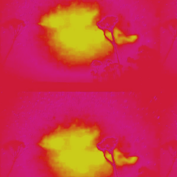

# FFMEPG
Video processing pipeline using FFMPEG CLI


## Installation
```bash
sudo yum -y install youtube -dl
sudo yum -y install ffmpeg ffprobe ffmpeg-devel
sudo yum -y install ImageMagick ImageMagick-devel ImageMagick-perl
```

## Instructions

### Processing a video from Youtube

```bash
video.get https://www.youtube.com/watch?v=QC8iQqtG0hg \
    | video.compress --quality 28 \
    | video.cut --from 00:00:01 --to 00:00:03 \
    | video.fade --in 0.1 --out 0.1 \
    | video.blur --intensity 8 \
    | video.gamma --intensity 2 \
    | video.brightness --intensity -0.3 \
    | video.contrast --intensity 1.1 \
    | video.saturation --intensity 0.11 \
    | video.sepia \
    | video.shine --intensity 0.1 \
    | video.vintage \
    | video.speed --intensity 1.5 \
    | video.mute \
    | video.reverse \
    | video.loop \
    | video.concat --with 172229ed8508dcc382436f72e39104a9.mp4 \
    | video.hstack --with 172229ed8508dcc382436f72e39104a9.mp4 \
    | video.vstack --with da07471345d91b1e3c2dd2691ed533a9.mp4 \
    | video.crop --top 1 --height 1400 --left 1 --width 1420 \
    | video.resize --width 600 --height 800 \
    | video.rotate --angle 180 \
    | video.levels --red 0.7 --green 0.1 --blue 0.4 \
    | video.to.mp4 \
    | video.to.gif
```

Results in: [47dafc0f8b8ca197abe051c7c3a1ef65.mp4](47dafc0f8b8ca197abe051c7c3a1ef65.mp4)


### Processing an audio from Youtube

```bash
audio.get "https://www.youtube.com/watch?v=iDO9J_3OVJ0" \
    | audio.cut --from 00:00:01 --to 00:00:06 \
    | audio.fade --in 0.2 --out 0.8 \
    | audio.concat --transition 0.5 --with e45837552f1204414815d4104648d361.mp3 

```

Results in: [5f8b2b4ef18228a4fbbec5715a37d387.mp3](5f8b2b4ef18228a4fbbec5715a37d387.mp3)

### Concatenating the video and the audio

```bash
video.merge 47dafc0f8b8ca197abe051c7c3a1ef65.mp4 --with 5f8b2b4ef18228a4fbbec5715a37d387.mp3
```

Yields the following result:

```bash
91c82313ab004aef9a3018ca43b3887a.mp4
```

### Processing frames as images

```bash
video.frames --fps 30 --dir /tmp/frames 47dafc0f8b8ca197abe051c7c3a1ef65.mp4
image.blur --intensity 120 /tmp/frames/frame_30_1.png \
    | image.contrast --intensity 1.3 \
    | image.brightness --intensity -20 \
    | image.resize --width 600 --height 800 \
    | image.square --size 300 \
    | image.saturation --intensity 87 
    | image.to.jpg
```

Results in:


